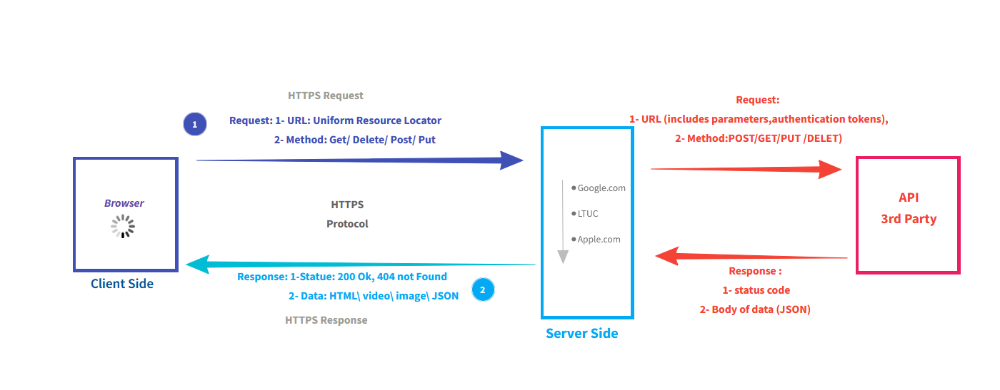
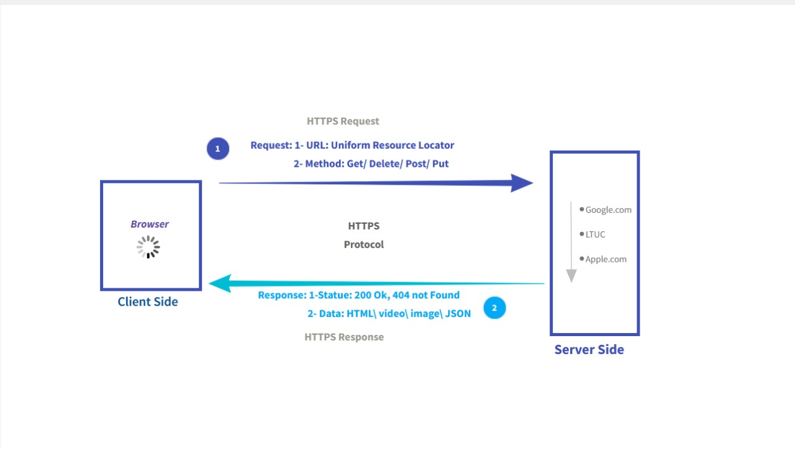

# Movies_Library - V.0.1 
  **Author Name**: Dima Salem
  

## Overview 
This project is an Express.js API for accessing movie data. It lets users fetch trending movies and search for movies by title. The app connects to The Movie Database API to get movie information.

## Getting Started
- Using Nodejs (RunTime enviroment )
- Install the cors Package
   - `npm install cors`
- Install nodemon Package 
   - `npm i nodemon`
- install axios and dotenv
    - `npm install axios dotenv`
## New Project Features   
- Trending Movies Endpoint:

    Endpoint: `/trending`.

    Description: Retrieves a list of trending movies from the TMDB API and returns the data as JSON.
- Search Movies Endpoint:

     Endpoint: `/search`. 

    Description: Allows users to search for movies based on their titles. Users can provide a query parameter (movieName) to search for specific movies. The endpoint queries the TMDB API and returns the search results as JSON.

# Movies-Library v.0.0
**Author Name**: Dima Salem

## Overview
#### This application serves as a basic framework for serving movie data and handling simple HTTP requests.

## Getting Started
- build a server using express
   - `npm init -y`: Use this command to create a package.json .
   - `npm install express` : To install the express package.
   - `npm file name ` : To run the server.

## Project Features
1. Server SetUp.
2. Routing 
    - Home Routing. 
    - Favorite Routing .
3. Error Handling: The app handel two type of error 
    - 500: "Internal Server Error".
    - 404: "Not Found".

